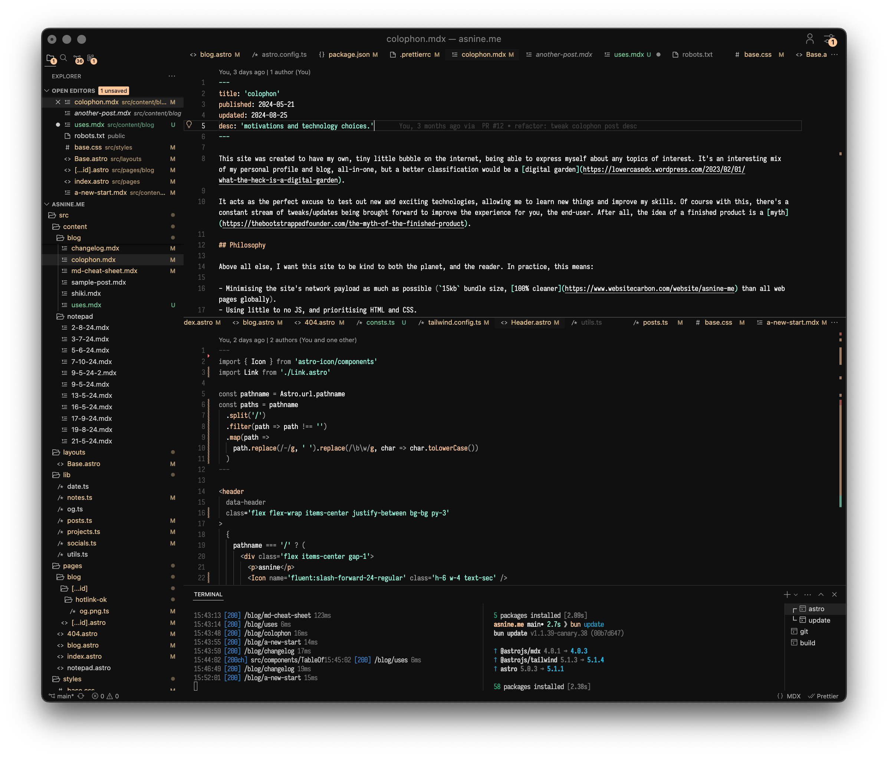
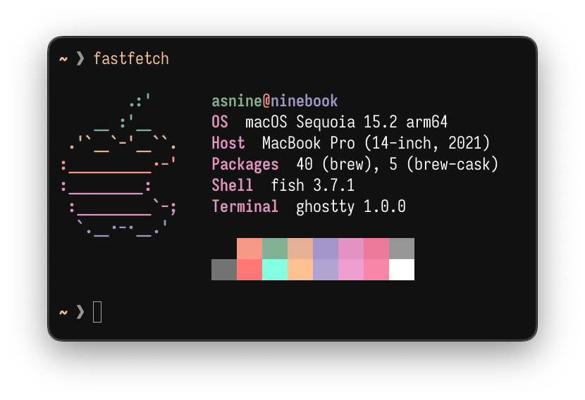
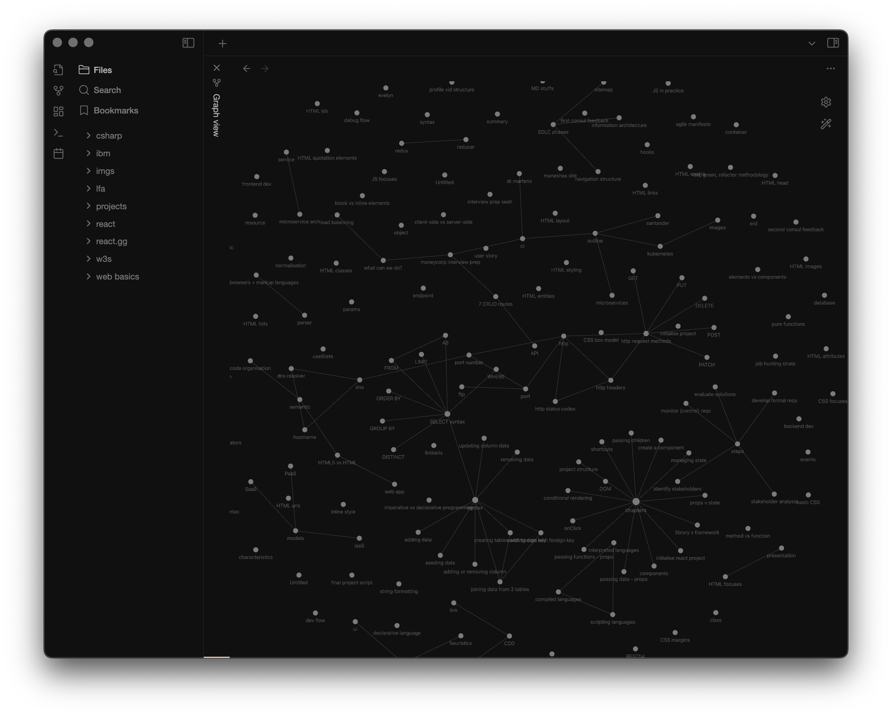
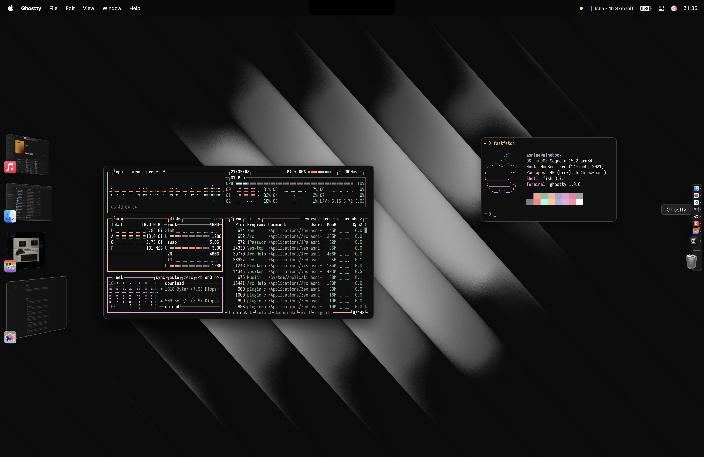

Below is a list of all the key tools, software and hardware that I use on the regular, with some screenshots added also for some eye-candy (or not 😆). Feel free to check out [uses.tech](https://uses.tech/) for a list of everyone's `/uses` pages!

---

## Hardware

<SectionList>
  <SectionListItem
    badge='laptop'
    title='MacBook Pro 14-in'
    desc='My personal laptop, with 16GB RAM, a 512GB SSD, with the M1 Pro processor. I resisted buying a Mac for the longest time, but the advantages of Apple Silicon in conjunction with the simple nature of MacOS made it a bit too irresistible.'
  />
  <SectionListItem
    badge='monitor'
    title='MSI PRO MP275Q'
    desc='My monitor for personal/work use, working at 1440p@100Hz. Gives me more than enough screen estate to tackle whatever may come my way, while having a decent-enough PPI to work well with my Mac.'
  />
  <SectionListItem
    badge='phone'
    title='iPhone 16 Pro Max'
    desc='My phone, for doing "phone" things. It’s simple, nails the fundamentals, and allows me to be more present in the moment (I’ve set it up to have a very small catalogue of essential apps).'
  />
  <SectionListItem
    badge='watch'
    title='Apple Watch Series 8'
    desc='Acts as a nice companion device to my phone, which mitigates the need to pick up my phone, while having a very comprehensive suite of health tracking features. The "Overnight Vitals" feature has been able to pick up when I’ve fallen ill, which is pretty cool in itself.'
  />
  <SectionListItem
    badge='earbuds'
    title='Samsung Galaxy Buds 2 Pro'
    desc='It was more convenient to own these over AirPods given I still had my Pixel 4a when I bought these. They sound amazing, to the point that I’d recommend getting these over the new 3 Pros (there’s not much of an improvement sound quality wise, in addition to the fact that they look like AirPods clones).'
  />
  <SectionListItem
    badge='iems'
    title='Truthear Hola'
    desc='My beloved wired iems, which for £18 (now discontinued) were a crazy steal, where these sound closer to £80 iems. These paired together with my Mac make for an amazing combo; long may they live.'
  />
</SectionList>

## Software

<SectionList>
  <SectionListItem
    badge='editor'
    title='Visual Studio Code'
    href='https://code.visualstudio.com'
    desc='Comes with a vast ecosystem of extensions, making me able to tailor it towards the languages I use, and code with minimal friction.'
  />
  <SectionListItem
    badge='terminal'
    title='Ghostty'
    href='https://ghostty.org/'
    desc='My terminal of choice, where it’s blazing fast (it uses Zig under the hood), and allows me to blitz through any commands/scripts that I need to run.'
  />
  <SectionListItem
    badge='browser'
    title='Arc'
    href='https://arc.net'
    desc='My browser of choice, where the concept of having "Spaces" and "Pinned Tabs" was truly ahead of it’s time. It has so many UX wins that I can’t see myself going back to a traditional browser, period.'
  />
  <SectionListItem
    badge='launcher'
    title='Raycast'
    href='https://www.raycast.com'
    desc='This app is phenomenal for quickly opening apps, running custom tasks (e.g. emptying the trash), and has a nice ecosystem of extensions that can run custom tasks related to specific applications (e.g. showing the currently playing song on Spotify).'
  />
  <SectionListItem
    badge='passwords'
    title='1Password'
    href='https://1password.com'
    desc='I use this to manage my passwords and 2FA codes as well for simplicity reasons. It was the first offering to provide Passkeys support (iirc), and comes with this nice "Watchtower" feature where you can see how strong your passwords are collectively.'
  />
  <SectionListItem
    badge='notes'
    title='Obsidian'
    href='https://obsidian.md'
    desc='I love the local-first approach, the wide variety of extensions available, and how you can structure your notes the way you want to (this came in very clutch during my uni years).'
  />
  <SectionListItem
    badge='misc'
    title='Swish'
    href='https://highlyopinionated.co/swish'
    desc='A neat window-manager app that leverages trackpad gestures.'
  />
  <SectionListItem
    badge='misc'
    title='BatFi'
    href='https://micropixels.software/apps/batfi'
    desc='A battery management app that allows me to set an indefinite charging limit on my Mac, without having to worry about Apple’s built-in battery optimisations messing things up.'
  />
  <SectionListItem
    badge='misc'
    title='BetterDisplay'
    href='https://betterdisplay.pro'
    desc='A display management utility that allows you to convert external displays to use Apple’s HiDPI, which gives you significantly sharper text. Hook this up nicely with a resolution that gives you enough screen estate (while still being crisp), and you’ve got a winner.'
  />
  <SectionListItem
    badge='misc'
    title='Clop'
    href='https://lowtechguys.com/clop'
    desc='An image, video, pdf and clipboard optimiser, which I’ve set up to run upon a file being copied/downloaded.'
  />
  <SectionListItem
    badge='misc'
    title='Alcove'
    href='https://tryalcove.com'
    desc='An app that emulates the functionality of the Dynamic Island on iPhones, and brings it over to the Mac.'
  />
  <SectionListItem
    badge='misc'
    title='Dropover'
    href='https://dropoverapp.com'
    desc='An app that makes drag and drop very easy, with you being able to group items into stashes.'
  />
</SectionList>

## Screenshots

